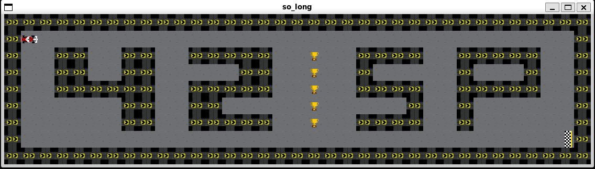
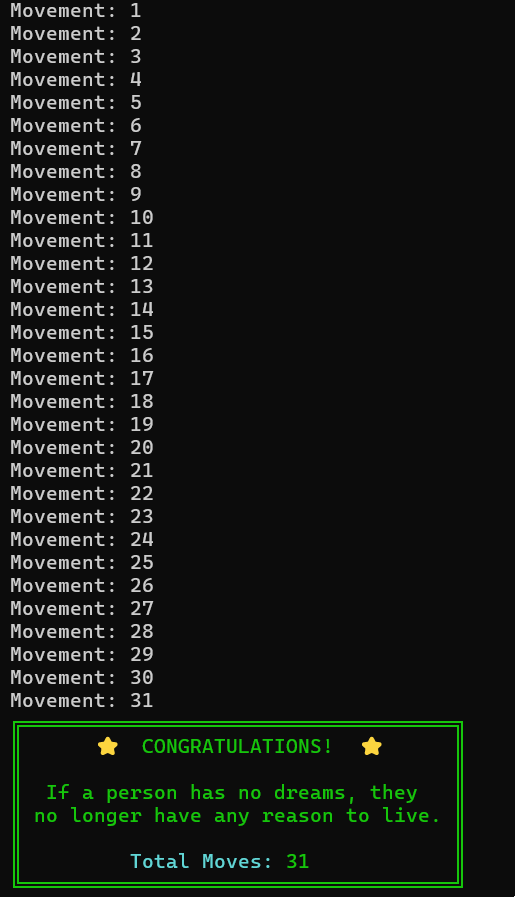

# 🎮 So Long

A 2D game in tribute to Ayrton Senna 🏎️ developed as part of the 42 São Paulo curriculum


---

## 📋 About the Project

**So Long** is a 2D game developed in C using the MiniLibX graphics library, created as a tribute to the legendary Brazilian driver **Ayrton Senna**. The objective is to collect all items on the map and escape through the exit using the shortest possible path.

> *"If a person has no dreams, they no longer have any reason to live."*  
> — Ayrton Senna

This project is part of the common core at [42 São Paulo](https://www.42sp.org.br/) and focuses on learning:
- Window and event management
- Texture and sprite manipulation
- Pathfinding and map validation algorithms
- Memory management in C

---

## 🎯 Features

### Mandatory Part
- ✅ Character movement with **W, A, S, D** keys
- ✅ Wall collision
- ✅ Collection of mandatory items
- ✅ Exit system after collecting all items
- ✅ Move counter displayed in terminal
- ✅ Complete map validation (.ber)
- ✅ Proper memory management (no leaks)
- ✅ Robust error handling

### Map Validations
The game validates the following map aspects:
- Rectangular format
- Surrounded by walls ('1')
- Contains exactly 1 player ('P')
- Contains at least 1 collectible item ('C')
- Contains exactly 1 exit ('E')
- Has a valid path between player, items, and exit
- Mandatory .ber extension

---

## 🚀 How to Use

### Prerequisites
- Operating system: Linux or macOS
- Compiler: `gcc` with flags `-Wall -Wextra -Werror`
- MiniLibX installed

### Compilation
```bash
# Clone the repository

$> git clone https://github.com/lucabarbosa/so_long.git
cd so_long

# Compile the project

$> make

# Run the game with a map
$> ./so_long maps/map.ber
```

### Makefile Commands
```bash
make        # Compiles the project
make clean  # Removes object files
make fclean # Removes executable and object files
make re     # Recompiles from scratch
make bonus  # Compiles with bonus features (if implemented)
```

---

## 🗺️ Map Format

Maps must have the **.ber** extension and contain only the following characters:

| Character | Meaning |
|-----------|---------|
| `0` | Empty space |
| `1` | Wall |
| `C` | Collectible item |
| `E` | Exit |
| `P` | Player starting position |

### Valid Map Example
```
1111111111111
1P01000000001
100001111C001
10001100000E1
1111111111111
```

---

## 🎨 Assets and Design

The project uses custom sprites and textures inspired by racing themes and in tribute to Ayrton Senna made by me in pixelart tools.

### 🎮 Gameplay

*In-game action showcasing the racing-themed sprites and map design*

### 🏁 Victory Screen
Upon completing the game, the player is greeted with one of Ayrton Senna's most inspirational quotes:



> *"If a person has no dreams, they no longer have any reason to live."*

A tribute to Brazil's greatest driver of all time and a reminder that we should always pursue our dreams.

---

## 📁 Project Structure

```
so_long/
├── src/                  # Main source code
│   ├── main.c
│   ├── map_validation.c
│   ├── game_loop.c
│   ├── player_movement.c
│   └── ...
├── mlx/                  # MiniLibX (42's graphics library)
├── images/               # Screenshots and visual assets
├── maps/                 # Test maps (.ber)
├── includes/             # Headers (.h)
├── Makefile
└── README.md
```

---

## 🎮 Controls

| Key | Action |
|-----|--------|
| **W** or **↑** | Move up |
| **A** or **←** | Move left |
| **S** or **↓** | Move down |
| **D** or **→** | Move right |
| **ESC** | Close the game |

---

## 🧪 Testing the Game

### Recommended Tests
1. **Valid maps**: Test different sizes and configurations
2. **Invalid maps**: Verify error handling
   - No valid path
   - No collectible items
   - Multiple players or exits
   - Non-rectangular
   - Not surrounded by walls
3. **Collisions**: Try moving through walls
4. **Move counter**: Check if it increments correctly
5. **Memory**: Use Valgrind to detect leaks

```bash
# Example test with Valgrind
valgrind --leak-check=full ./so_long maps/map.ber
```

---

## 📚 Applied Concepts

### Algorithms
- Flood Fill for path validation
- Tile-based collision system
- File parsing and validation

### Graphics Management
- Sprite rendering with MiniLibX
- 2D coordinate system
- Event handling (keyboard and window)

### Best Practices
- Modular and organized code
- Norminette compliance (42)
- Proper memory management
- Consistent error handling

---

## 🐛 Error Handling

The program displays `"Error\n"` followed by a specific message for:
- Map file not found
- Incorrect extension (not .ber)
- Map with invalid characters
- Non-rectangular map
- Missing mandatory elements
- Duplicate player/exit
- Invalid path between elements
- Map not surrounded by walls

---

## 📖 Resources and References

### Official Documentation
- [MiniLibX Documentation](https://harm-smits.github.io/42docs/libs/minilibx)
- [42 Norminette](https://github.com/42School/norminette)

### Graphic Assets
- [itch.io](https://itch.io/) - Free sprites and tilesets
- [OpenGameArt](https://opengameart.org/) - Open source assets

### Useful Tutorials
- MiniLibX guides
- Pathfinding algorithms

---

## 📝 License

This project was developed for educational purposes as part of the 42 São Paulo curriculum.

---

## 🙏 Acknowledgments

- **42 São Paulo** for the learning opportunity
- **Peers** who helped with peer reviews and debugging
- The **42 community** for sharing knowledge
- **Ayrton Senna**, for inspiring generations of Brazilians to dream big 🏎️

---

#### **"So Long, and Thanks for All the Fish!"** 🐬🐟